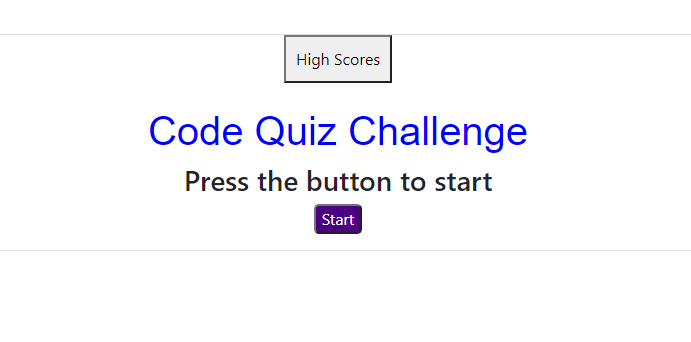

# Web-APIs
Web-APIs
* Repository contains quality README file with description, screenshot, and link to deployed application.
Web-APIs Javascript

* This API is a quiz that counts down
   -as it counts down it takes 15s off for wrong answers
* User enters initials at end and can click high score to see their score in a list 

Deployed appliction:  https://eschiavoni2.github.io/Web-APIs/